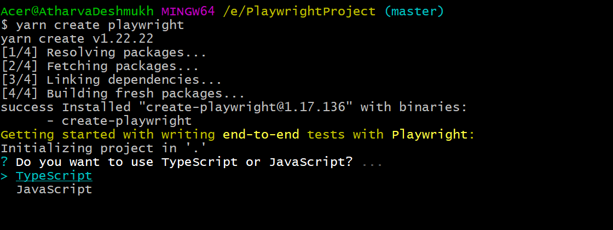
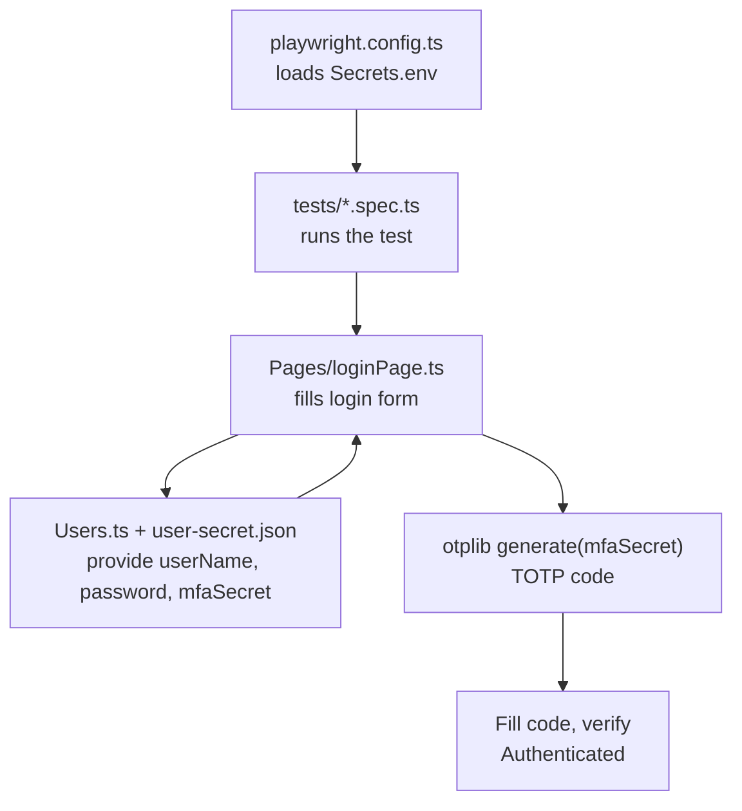

# Installation

- yarn create playwright (choose between TypeScript or JavaScript (default is TypeScript))

To generate tsconfig.json file 
npx tsc --init 

- Command to run in UI mode:
  yarn run playwright test --ui

Tests are picked from this option in config: testDir: './tests'
Spec pattern can be specified by testMatch: '**/*.spec.ts'

## Authentication Flow

How the files are assembled, in load/call order, to log a test user in:

| File | Role |
| --- | --- |
| `playwright.config.ts` | Loads `Secrets.env` into `process.env` before any test runs. |
| `tests/*.spec.ts` | Entry point; triggers the login flow via a page object. |
| `Pages/loginPage.ts` | Drives the UI and retries MFA on failure. |
| `Users.ts` / `user-secret.json` | Supply each user's credentials and MFA secret. |
| `otplib` (`generate`) | Turns the `mfaSecret` into a time-based 6-digit code. |

